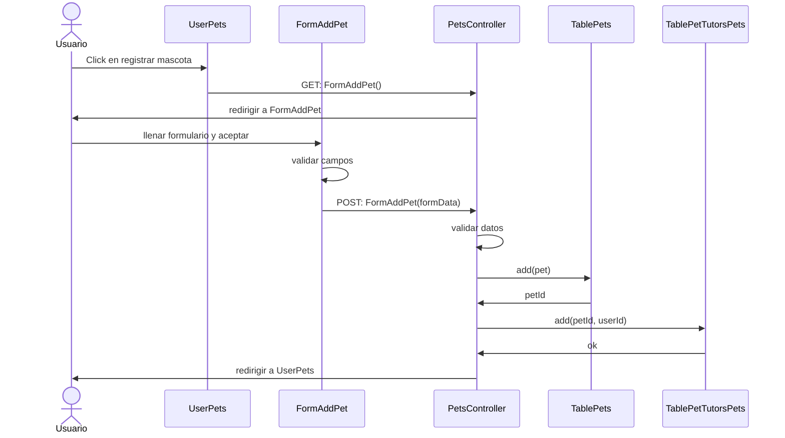

|<!-- -->|<!-- -->|
|:-------------:|:---------------:|
|Caso de uso|Registrar mascota|
|Descripción|El usuario registra una mascota en la aplicación|
|Actores|Usuario|
|Pre condición|El usuario debe estar en la vista UserPets con el listado de sus mascotas si las tuviese.|
|Post condición|El usuario es devuelto a la vista UserPets listando la nueva mascota registrada.|
|Excepciones|El usuario no inició sesión. Los datos ingresados son incorrectos.|

